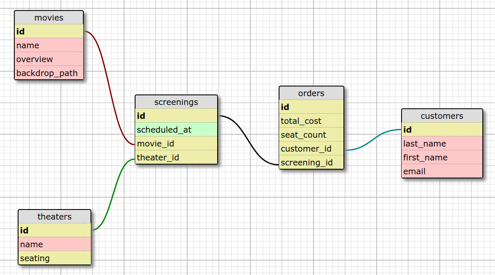

### Tools used

* Rails 5 (requires ruby 2.2.2+)
* PostgreSQL  9.5.12
* Bootstrap 4

### Schema

### App setup

*Install steps performed on Linux Mint OS based on Ubuntu 16.04.*

* `git clone git@github.com:trodicaro/movies.git`
* `cd movies`
* `gem install bundler`
* `export MOVIES_DATABASE_PASSWORD=your_password` (redo this step when rebooting)
* if postgres user password not known ([per this SO thread](https://stackoverflow.com/questions/7695962/postgresql-password-authentication-failed-for-user-postgres)): 
    `sudo -u postgres psql -c "ALTER USER postgres PASSWORD 'postgres';" && sudo service postgresql restart`
* `sudo -u postgres -- psql -c "CREATE USER movies with password 'your_password';"`
(a PostgreSQL install tutorial [on this Digital Ocean how-to](https://www.digitalocean.com/community/tutorials/how-to-use-postgresql-with-your-ruby-on-rails-application-on-ubuntu-14-04))
<!-- * `create database movies_development; create database movies_test;` -->
* `bundle install`
* `rails db:create db:migrate`

### Run tests
* `bundle exec rspec`

### View app
* `rails s` and in browser visit http://0.0.0.0:3000/

### MVP user stories
* As a customer I want to see a page with upcoming movies scheduled at each theater
* As a customer I want to see which movies are sold out (disabled)
* As a customer I want to purchase tickets for an available showing
* As a customer I want to receive an email confirmation (not implemented yet)
* As a theater owner I want to see on my dashboard popular movies
* As a theater owner I want to see on my dashboard popular times
* As a theater owner I want to see on my dashboard revenue by day of the week
* As a theater owner I want to see on my dashboard total revenue (not implemented yet)

### Future development plans
* set up FactoryBot, Database Cleaner and write tests for the existing functionality as well as going forward
authentication to use dashboard
* automate the setup ([sample how-to](https://www.digitalocean.com/community/tutorials/how-to-install-and-use-docker-on-ubuntu-16-04))
* continuous integration and test coverage ([sample how-to](https://medium.com/craft-academy/getting-started-with-rails-tests-continuous-integration-deployment-7b5bfec905a5))
* save pics with Paperclip ([sample how-to](http://julianveling.com/?p=18))
* React-ify some components (eg:movie, movie list, etc)
* Implement tablesorter widgets for subtotals and filtering.

### Notes
* App seeds and uses links for movie images via themoviedb API - must be connected to internet to work
* Removed gem Spring - it kept not killing the server processes and it lead to errors with registering new code (eg: changes in secrets.yml didn't reflect in Rails.application.secrets)
